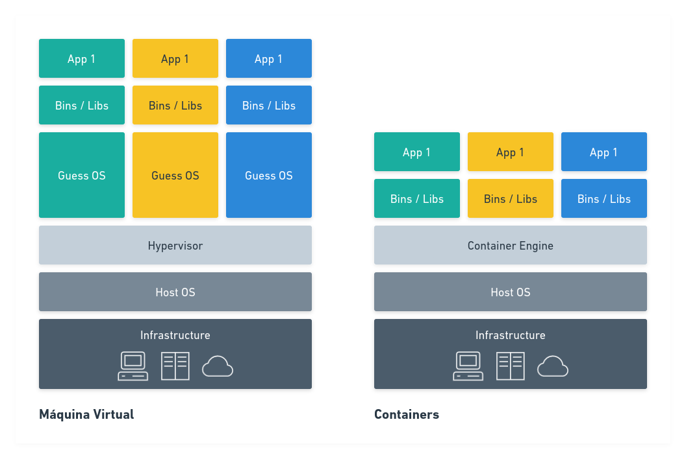

    

<h1 align="center">Containers4Noobs</h1>

    

# Introdução

Esse 4Noobs tem como objetivo ajudar quem quer começar a entender o conceito de containers, como utilizar, suas vantagens e ferramentas.

Ao longo do guia eu vou usar alguns ícones como informações extras, então, aqui está a legenda:

- 👍 = Recomendado
- 💰 = Pago

# Requisitos

Para trabalhar de forma eficiência com containers você vai precisar saber um pouco de Linux, existe um 4Noobs para isso aqui: [Linux4Noobs](https://github.com/lucashe4rt/linux4noobs)

Você também vai precisar saber instalar aplicações no seu computador (seja, Linux, Windows ou Mac). E isso nos leva ao próximo requisito, você vai precisar de um computador.

Eu recomendaria no mínimo um i5 (ou equivalente) com pelo menos 8Gb de memória e uns 60Gb de espaço livre em disco.

# Roadmap

## Introdução

### O que são containers?

Container é uma tecnologia para criar um ambiente isolado para rodar serviços. Tentando ser o mais claro possível: é como se você tivesse distribuíndo junto com a sua aplicação/serviço todo o sistema configurado, necessário para que a aplicação seja executada sem muitos problemas. 

Desta forma, isso também permite que esta aplicação seja facilmente movida de um contexto/servidor para outro, sem grandes problemas.

Existem algumas pessoas que costumam chamar containers de Docker, e isso é equivocado, um container é um processo, enquanto o Docker é um serviço de container. Existem vários outros serviços para rodar containers, Docker é apenas um dos mais conhecidos.

Cada container deve ter apenas uma responsabilidade, ou seja, executar apenas uma aplicação/serviço. Desta forma você consegue isolar ambientes e processos, garantido que não haja conflito entre dependências ou até mesmo mapeamento de portas, etc.

### VM ou Container?

Vale lembrar que, apesar de bastante similar as abordagens são completamente diferentes. Para entender melhor, observe o gráfico abaixo:

  

No gráfico, é possível compreender de uma forma simplificada a diferença entre as arquiteturas. Enquanto uma VM possuí um sistema operacional convidado (Guess OS) separado para rodar a aplicação, a arquitetura de Containers elimina essa necessidade mas mantendo o isolamento da aplicação.

Enquanto uma VM emula (virtualiza) um computador com acesso a recursos de hardware e roda em cima do Hypervisor, um Container tente apenas a conter a aplicação e suas dependências, compartilhando a maioria das outras coisas com o sistema operacional hospedeiro.

Desta forma é fácil dizer que obrigatoriamente, uma VM é muito mais 'pesada' que um Container. Inclusive, dado ao design da VM é possível possível rodar Containers dentro de dela, e isso é uma prática bastante comum, para isolar ambientes, inclusive é o que normalmente acontece em muitos serviços de cloud.

  
🔖 Leitura complementar

  <ul>
    <li>🇺🇸 <a href="https://www.ibm.com/cloud/blog/containers-vs-vms">Containers vs. Virtual Machines (VMs): What’s the Difference?</a></li>
  </ul>

### Docker, LXC. Quais são as diferenças?

É bastante comum as pessoas se referirem a Docker como sinônimo de Containers, mas entretanto, é importante saber que Docker é apenas um dos tipos, ou engine, para execução de Containers. Inclusive ela nem foi a primeira tecnologia para containers.  

Se eu for entrar em detalhes miúdos sobre as diferenças entre Docker e LXC nós vamos ter que nos aprofundar bastante em alguns termos e conceitos que eu não sei se todos vocês estão familiarizados, sendo assim, vou tentar fazer uma abordagem bem simplificada sobre o assunto.

Acho que a primeira coisa que vocês devem estar se perguntando é: O que é LXC? E essa é uma pergunta bem simples de se responder, e eu vou primeiro repetir algo que eu disse lá em cima "Containers são Linux". Dito isso, LXC literalmente significa "Linux Containers". LXC possuem um design muito mais flexível que containers Dockers, e muito mais próximos de uma VM, isso quer dizer que, você pode praticamente instalar qualquer coisa neles. Você pode considerar o LXC como a primeira impelemtação de containers.

Para você ter uma ideia, o próprio Docker, originalmente começou como um fork do LXC. Porém seguiu uma abordagem de design um pouco diferente, tendo seu foco na execução de microserviços, e substituindo eventualmente o LXC pela sua implementação própria chamada de `libcontainer`.

  
🔖 Leitura complementar

  <ul>
    <li>🇺🇸 <a href="https://earthly.dev/blog/lxc-vs-docker/">LXC vs Docker: Which Container Platform Is Right for You?</a></li>
  </ul>

## Como instalar?

Tenha em mente que existem diversos concorrentes no mercado, para executar/gerenciar Containers, você pode encontrar [uma lista aqui](https://www.makeuseof.com/best-docker-alternatives/). A minha recomendação aqui fica para o uso do [Podman](https://podman.io/), pois considero ele mais leve e muito mais amigável para quem pretende migrar para Kubernetes.

[Instalação no Windows](/pages/Instalacao%20Windows.md)

## Usando containers
@TODO

## Orquestrando containers

### Kubernetes
@TODO

### Openshift
@TODO

### Docker Swarm
@TODO

# Recursos

## Livros

- 🇺🇸👍 [OpenShift for Developers, Second Edition](https://developers.redhat.com/e-books/openshift-for-developers)
- 🇺🇸 [Containers Networking: From Docker to Kubernetes](https://www.nginx.com/resources/library/container-networking-docker-kubernetes/)
- 🇧🇷👍 [Como criar aplicações modernas com containers Linux](https://www.redhat.com/pt-br/resources/building-modern-apps-with-containers-ebook)
- 🇧🇷💰 [Contrainers com Docker: Do desenvolvimento à producação](https://www.amazon.com.br/Containers-com-Docker-desenvolvimento-produ%C3%A7%C3%A3o-ebook/dp/B019NJB50C)

## Ferramentas

- [Docker](https://www.docker.com/)
- 👍 [Podman](https://podman.io/)

## Cursos completos

- 🇺🇸👍 [Kubernetes Crash Course for Absolute Beginners](https://www.youtube.com/watch?v=s_o8dwzRlu4)

## Vídeos

- 🇧🇷👍 [O mínimo que você precisa saber sobre Docker](https://www.youtube.com/watch?v=ntbpIfS44Gw)
- 🇧🇷👍 [Containers, Docker e Kubernetes com Giovanni Bassi](https://www.youtube.com/watch?v=wxLvvMxzc1Q)
- 🇧🇷 [Containers // Dicionário do Programador](https://www.youtube.com/watch?v=-pUZBovqRcU)
- 🇧🇷 [Afinal, o que é um container?](https://www.treinaweb.com.br/blog/afinal-o-que-e-um-container)

# Como contribuir

Contribuições fazem com que a comunidade opensource seja um lugar incrível para aprender, inspirar e criar. Todas contribuições são extremamente apreciadas.

- Realize um Fork do projeto
- Crie um branch com a nova feature (git checkout -b feature/sua-feature)
- Realize o Commit (git commit -m 'Adicionado conteudo brabo')
- Realize o Push no Branch (git push origin feature/sua-feature)
- Abra um Pull Request

Não sabe usar Git? [Git4Noobs](https://github.com/DanielHe4rt/git4noobs)

# Contribuidores

  

  

